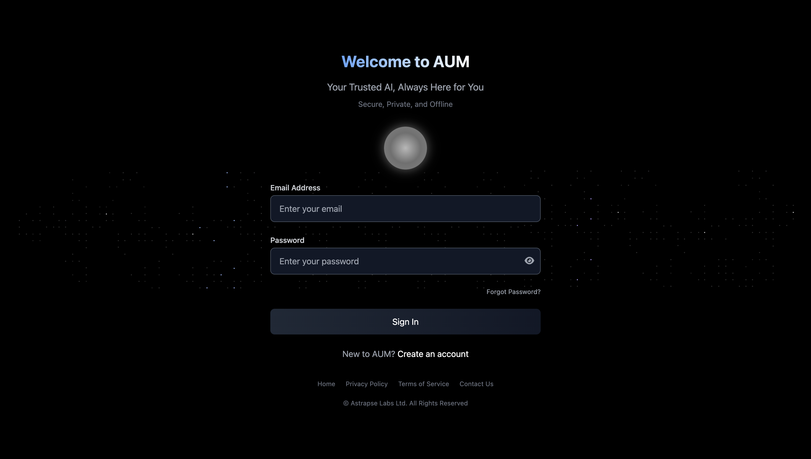

## Getting Started with AUM

Follow these simple steps to install and start using AUM on your device.

### 1. Create an Account

Create your free account on [aumbot.co/register](https://aumbot.co/register) to access your download files and personalized setup.

### 2. Download AUM

Choose your operating system below and download the appropriate version of AUM.

<Tabs items={['Mac', 'Windows']}>

  <Tab title="Mac">
    - Visit your [dashboard](https://aumbot.co/dashboard) after signing in  
    - Download the correct **macOS** version of AUM  
      - Use the **Intel** version if you're on an older Intel-based Mac  
      - Use the **Silicon** version if you have an M1/M2/M3 Mac (Apple Silicon)  
    - Ensure you allow installations from unknown developers if prompted  
    

    ### 3. Unzip & Install (macOS)

    After downloading:
    - Unzip the `.zip` file  
    - Move the AUM app to your **Applications** folder  
    - Launch the app  

    If you're prompted with a security warning, follow these steps:

    1. Go to **Apple Menu > System Settings**  
    2. Select **Privacy & Security** from the sidebar  
    3. Scroll to **Security** section  
    4. Click **Open Anyway**  
    5. Enter your login password, then click **OK**

    

    <Note icon="info">
    Initial launch may take a few moments as the AI model is being downloaded.
    </Note>
  </Tab>

  <Tab title="Windows">
    - Visit your [dashboard](https://aumbot.co/dashboard) after signing in  
    - Download the **Windows** version of AUM (EXE or ZIP)  
    - ⚠️ <strong>Installer coming soon</strong>: For now, Windows support is in final polishing.  
    - When available, if Windows Defender shows a warning, click:  
      **More Info → Run Anyway**  

    
  </Tab>

</Tabs>

### 4. Start Using AUM

Once AUM is installed:
- Open the app  
- Log in using your account  
- You're ready to go!

You can access the **Shortcuts Bar** anytime from your **Profile Sidebar** for quick actions and inspiration.

